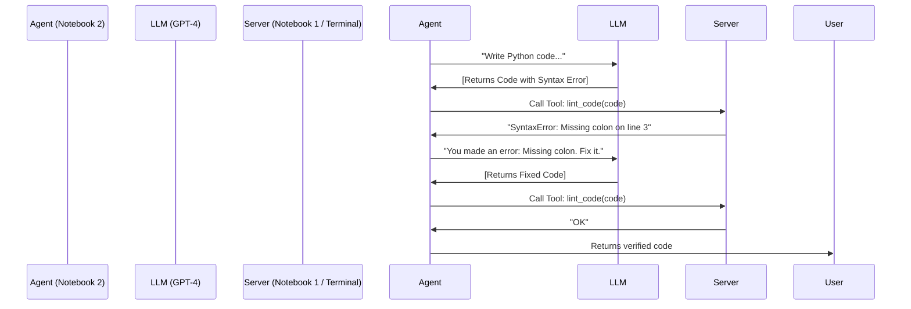

# Agentic AI Workshop: The Evaluator-Optimizer Loop with MCP

This repository contains the workshop materials for building a **Self-Correcting Coding Agent** using the [Model Context Protocol (MCP)](https://modelcontextprotocol.io/).

In this workshop, we move beyond simple chatbots to architect a system where an AI agent writes code, lint-checks it against a deterministic server, and automatically fixes its own errors before showing you the result.

## 🏗 Architecture

This project implements the **Evaluator-Optimizer** pattern using a Client-Server architecture:



## 📂 Repository Structure

* **`01_server_deployment.ipynb` (The Hands):**
    * Builds the MCP Server.
    * Defines the tools: `lint_code` (Evaluator) and `run_safe_python` (Executor).
    * Generates the `server.py` file.
* **`02_agentic_loop.ipynb` (The Brain):**
    * Acts as the MCP Host.
    * Connects to the server via HTTP SSE.
    * Runs the recursive "Generate → Evaluate → Optimize" loop.

## 🚀 Getting Started

### Prerequisites
* Python 3.10 or higher
* An OpenAI API Key (or Anthropic/OpenRouter equivalent)

### Installation

1.  **Clone the repository:**
    ```bash
    git clone [https://github.com/jemsbhai/MCPLectures.git](https://github.com/jemsbhai/MCPLectures.git)
    cd MCPLectures/eval-optimize
    ```

2.  **Install dependencies:**
    ```bash
    pip install fastmcp uvicorn openai mcp
    ```

3.  **Set your API Key:**
    ```bash
    export OPENAI_API_KEY="sk-..."
    # Or set it in a .env file
    ```

---

## ⚡ How to Run the Workshop

Because MCP uses a client-server model, **you cannot run this entirely inside a single notebook window.** You must follow this 3-step process:

### Step 1: Generate the Server
Open `01_server_deployment.ipynb` in Jupyter/VS Code and run all cells.
* **Outcome:** This will create a file named `server.py` in your directory.
* *Note: This notebook does not start the server; it only builds the code.*

### Step 2: Start the Server (Terminal)
Open a terminal window in the repository folder and run:

```bash
fastmcp run server.py --transport sse --port 8000
```

You should see:
> `INFO:     Uvicorn running on http://0.0.0.0:8000 (Press CTRL+C to quit)`

**⚠️ Keep this terminal window open!** Your agent needs this "heartbeat" to function.

### Step 3: Run the Agent
Open `02_agentic_loop.ipynb` and run the cells.
* The agent will connect to `http://localhost:8000/sse`.
* It will attempt to write a Fibonacci script with an intentional error.
* Watch the output as it detects the error via the server and self-corrects.

---

## 🛡️ Security Note

The `run_safe_python` tool in this workshop uses Python's `exec()` function with limited globals.
* **For Workshop Use Only:** This is safe for local demos.
* **For Production:** NEVER use `exec()` on a public server. Production MCP servers should run untrusted code inside isolated Docker containers or Firecracker microVMs.

## 📚 Resources
* [Model Context Protocol Docs](https://modelcontextprotocol.io/)
* [FastMCP Documentation](https://github.com/jlowin/fastmcp)
* [Anthropic: Building Effective Agents](https://www.anthropic.com/research/building-effective-agents)
